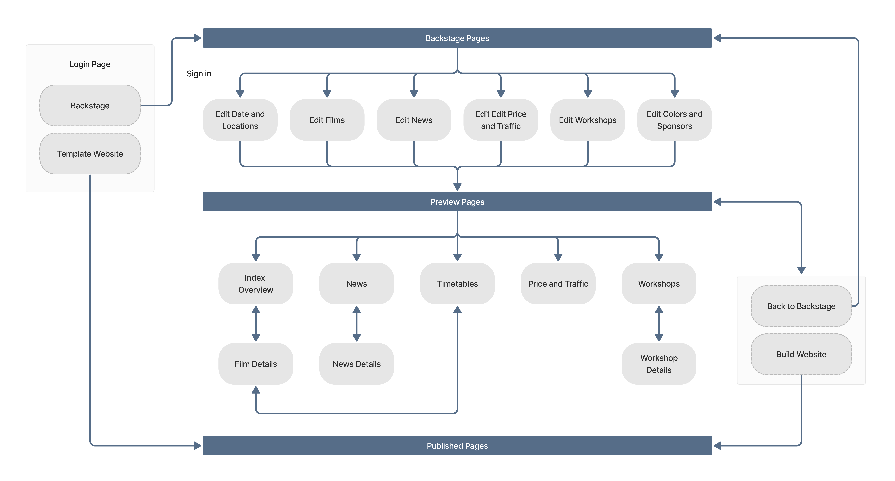

<h1 align="center">
  
</h1>
<h4 align="center"> A promotion platform that offers a way to quickly launch your film festival website and share your audience.</h4>
<h4  align="center" >
<a href="https://your-film-festival-d2cd4.web.app/" >Website Link</a>
</h4>

 

##  Table of Contents

*  [Flow Chart](#FlowChart)
*  [Demo](#Demo)
*  [Techniques](#Techniques)
*  [Contact](#Contact)

##  Flow Chart

  <h4 align="center" style="margin-top: 0px; margin-bottom: 24px">
     <kbd>
      
    </kbd>
  </h4>

##  Demo

###  Backstage Pages

- In backstage section, it provides plenty of inputs for uploading your film festival information and users customization.

  > Enable select hosted date and fill in festival details.

  <h4 align="center" style="margin-top: 0px; margin-bottom: 24px" >
     <kbd>
      
    </kbd>
  </h4>

  > Uploade film trailers, stills and fill in features informations. 
 
   <h4 align="center" style="margin-top: 0px; margin-bottom: 24px">
   <kbd>
    
    </kbd>
  </h4>

  > Manage the distribution of news contents and workshops, users can add important tag onto each contents, it will display an obvious layout on built website.

    <h4 align="center" style="margin-top: 0px; margin-bottom: 24px">
     <kbd>
      
    </kbd>
  </h4>

  > Customize website look by selecting primary, secondary and text color.

    <h4 align="center" style="margin-top: 0px; margin-bottom: 24px">
     <kbd>
      
    </kbd>
  </h4>

   <h4 align="center" style="margin-top: 0px; margin-bottom: 24px">
     <kbd>
      
    </kbd>
  </h4>

###  Preview Pages

- In preview section, it allows users to preview the accomplished website temporarily and switches back to the backstage page for modification. Users can publish the website anytime once all contents are confirmed.

  > Modify contents promptly by switching between backstage pages and preview pages.

  <h4 align="center" style="margin-top: 0px; margin-bottom: 24px">
     <kbd>
      
    </kbd>
  </h4>
  
  > Build the website and get a new link.

  <h4 align="center" style="margin-top: 0px; margin-bottom: 24px">
     <kbd>
      
    </kbd>
  </h4>

###  Published Pages

- The Built website include all information of film festival that users can share the link to their audience.

  > Search the film timetables by date.
  <h4 align="center" style="margin-top: 0px; margin-bottom: 24px">
     <kbd>
      
    </kbd>
  </h4>
  
  > Fill in contact information for signing up a workshop.

    <h4 align="center" style="margin-top: 0px; margin-bottom: 24px">
     <kbd>
      
    </kbd>
  </h4>

##  Techniques

- Built with **React.js** and **React Router**.
- Implemented email functionality with **Node.js**, **React.js**, **Nodemailer**, and **OAuth2**. Deployed the server to **Heroku**.
- Managed the state of the application using **Redux**.
- Created **responsive web design** layout through **Tailwind CSS**.
- Used **Firebase Firestore** and **Storage** for data management.
- Applied dynamic styles with **Tailwind CSS** using **JIT mode**.

##  Contact

- Author: Roger Lou
- E-mail: jielou.roger@gmail.com
